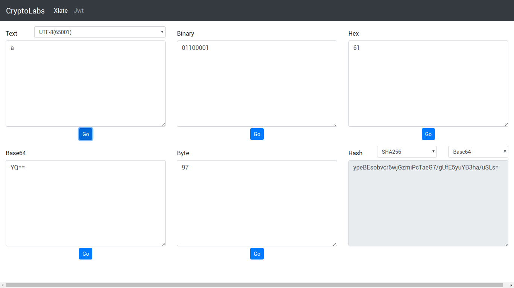

# Cryptolab
A simple react frontend application to convert data from one format to other.
Supported format.  
_**Text**_    
**_Binary_**  
**_Base64_**  
**_Byte_**  
**_Hash_**  

-----------
## Getting Started
1. Download the code.
1. open terminal, cd to root folder.
1. run command `npm install`
1. run command `npm run start`

-------

## Screenshot
